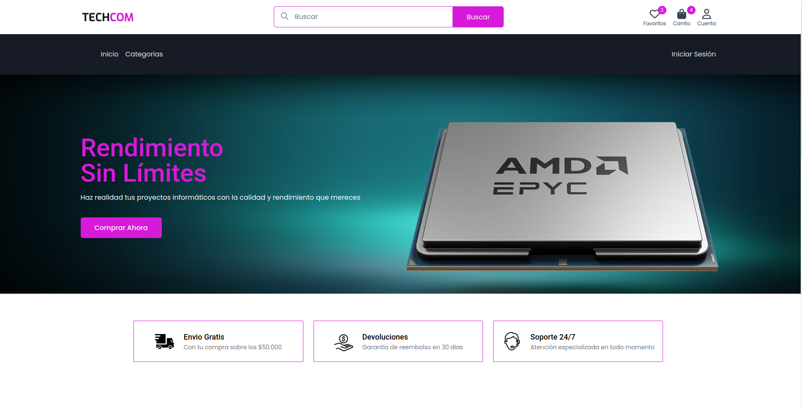
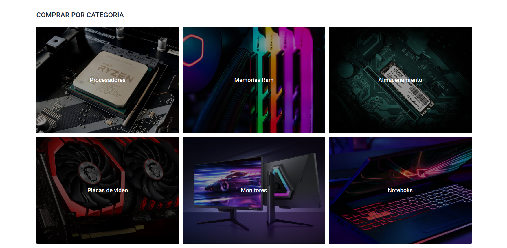
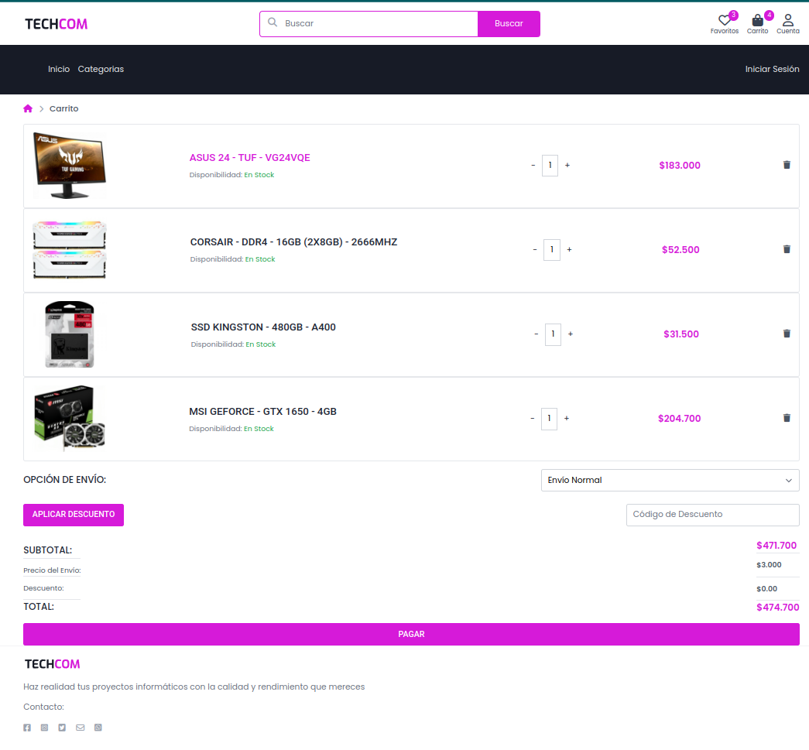

# Nombre del Proyecto
<p>
    
</p>

## Descripción

La gran idea de nuestro proyecto es establecer un eCommerce líder en el mercado de componentes de computación, ofreciendo una amplia gama de productos y servicios relacionados con la tecnología informática. Nuestra ambición es convertirnos en un referente en la industria. La idea realista consiste en crear una tienda en línea de componentes de computación que satisfaga las necesidades de los clientes en lo que respecta al hardware y software, así como brindar servicios de soporte técnico. Nuestra meta es proporcionar soluciones tecnológicas asequibles y confiables. La idea más pequeña es iniciar un eCommerce de componentes de computación con un enfoque en un mercado específico, como la venta de tarjetas gráficas de alto rendimiento para entusiastas de los videojuegos. Esta idea más pequeña nos permitirá ofrecer una selección específica de productos.

## Capturas de Pantalla

<p>
    
    
    
</p>


## Tecnologías Utilizadas

- React
- HTML
- Tailwind CSS


## Instalación y Ejecución

A continuación, te proporcionamos los pasos necesarios para clonar, instalar y ejecutar este proyecto en tu propio entorno. Asegúrate de seguir estos pasos cuidadosamente:

1. **Clonar el Repositorio**:

   Clona el repositorio desde GitHub a tu máquina local utilizando el siguiente comando:

   ```bash
   git clone https://github.com/juanjcenturion/efiprog.git
2. **Navega al directorio del proyecto**:
   ```bash
   cd efiprog
2. **Instala las dependencias**:
    ```bash
    npm install
4. **Inicia la aplicación**:
    ```bash
    npm run dev
